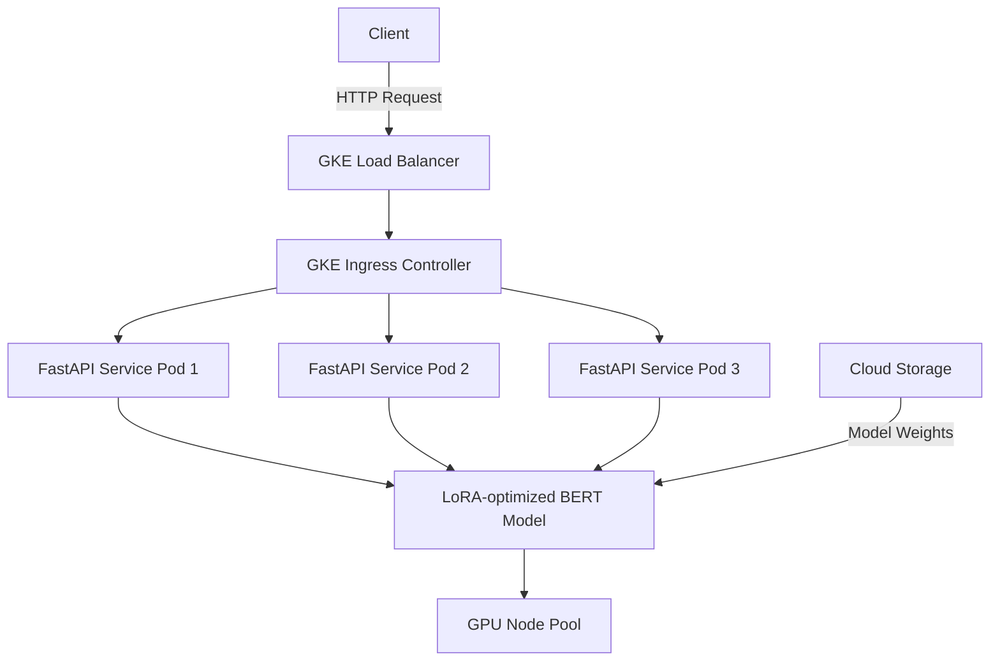
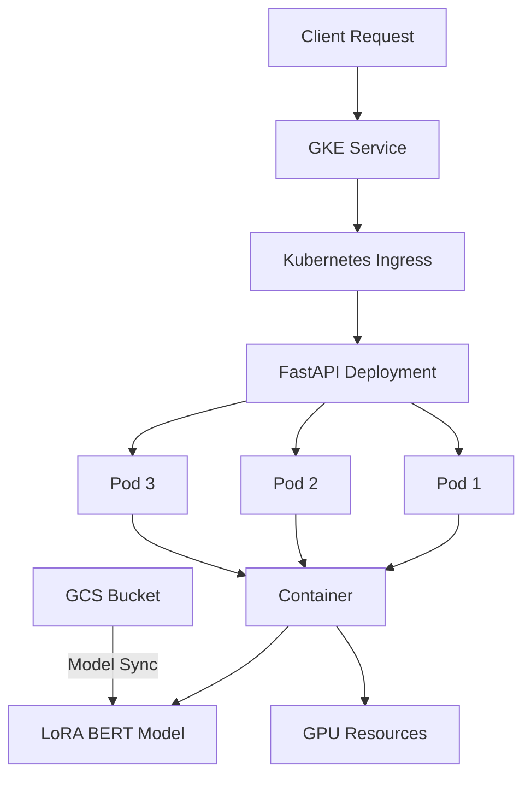
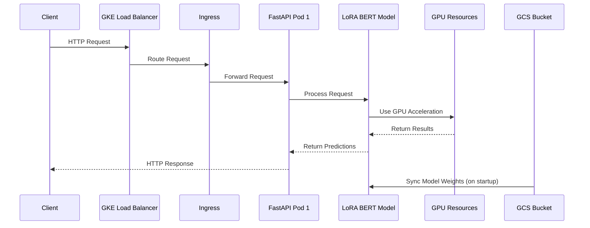

# bert_lora_fastapi
## Deploying a LoRA-optimized BERT model as a FastAPI service with Minikube and GKE

### 1. High-Level System Architecture

> __Components__
- __Client__: End user or application making requests
- __GKE Load Balancer__: Distributes traffic across ingress controllers
- __GKE Ingress Controller__: Routes traffic to appropriate pods
- __FastAPI Service Pods__: Containerized FastAPI instances (3 replicas)
- __LoRA-optimized BERT model__: ML model loaded in memory
- __GPU Node Pool__: GKE nodes with GPU acceleration
- __Cloud Storage__: Where the model weights are stored (GCS bucket)

---

### 2. Detailed Kubernetes Architecture

> __Components__
- __GKE Service__: Kubernetes Service exposing the FastApi deployment
- __Kubernetes Ingress__: Manages external access to the service
- __FastAPI Deployment__: Manages the 3 replicas of your application
- __Pods__: Individual containers running the FastAPI app
- __Container__: Docker container with the FastAPI app
- __LoRA BERT Model__: The actual ML model loaded in memory
- __GPU Resources__: GPU allocation for the pods
- __GCS Bucket__: Google Cloud Storage for modal weights

---

### 3. Data Flow Diagram

> __Flow__
- Client sends HTTP request to GKE Load Balancer
- Load Balancer routes to Ingress Controller
- Ingress routes to one of ther FastAPI pods
- Pod loads the LoRA BERT model (syncing weights from GCS if needed)
- Model uses GPU acceleration for inference
- Results are returned through the same path

